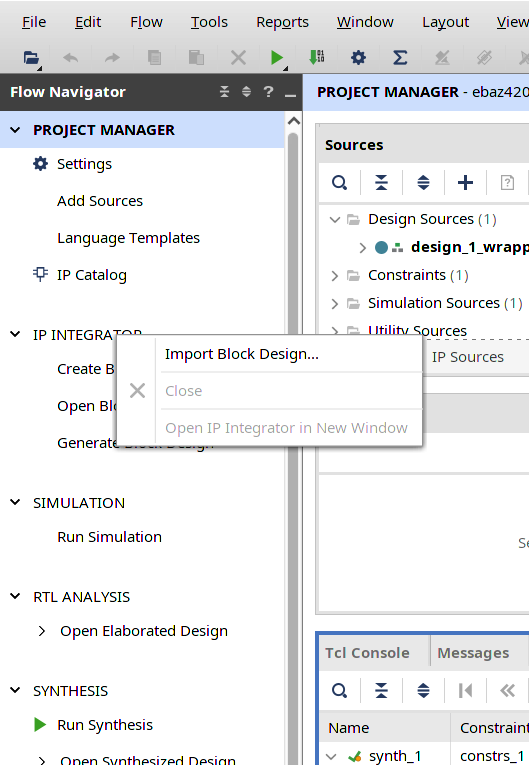
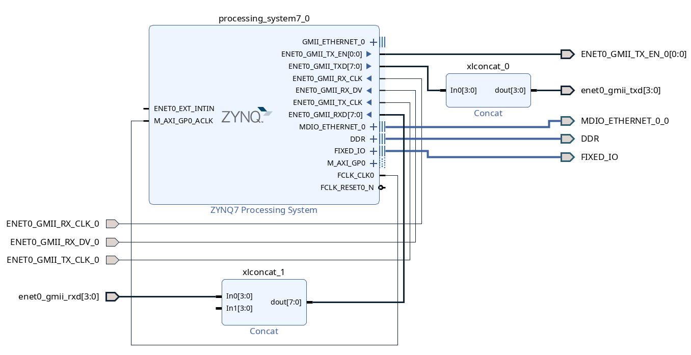
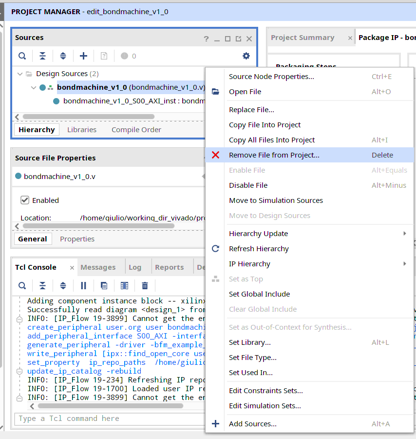
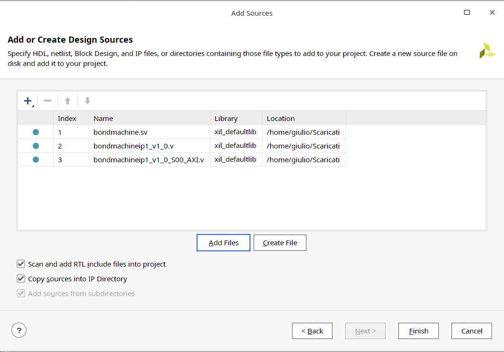
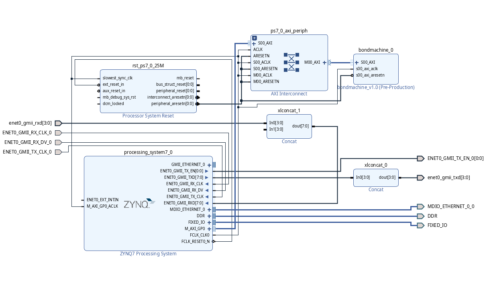

# Bondmachine_ebaz4205_buildroot

## How to make a bondmachine accelerator on Zynq EBAZ4205.

The following guide is a step by step tutorial on how to create a bondmachine accelerator using the Zynq EBAZ4205 board.</br>
This tutorial can be broken down into three blocks:
in the first one is shown how to create the block design using Vivado and how to export the bitstream and the programmable logic; the second block will focus on Linux-based image creation using buildroot; finally in the last block is shown how to test the accelerator directly from the OS.
Requirements:
<ul>
<li> Board Zynq EBAZ4205 </li>
<li> USB to serial converter </li>
<li> Vivado 2020.2 with Vitis </li>
<li> Buildroot 2020.2 </li>
<li> Bondmachine sources </li>
</ul>


## Create block design

Create a new project on Vivado and be sure to select the correct part and product family of the EBAZ4205 (*xc7z010clg400-1*).</br>


Open project manager (usually open by default), right click on *ip integrator* and select *Import block design...* in order to import the base working block design already configured.


As you can see from the diagram, there is already the *ZYNQ7 Processing System* and all the pins relating to the network port are already configured. You are probably wondering why concat modules: the standard IP for the Gigabit Ethernet GMII port (TX, RX) has 8 bit while the interface MII (TX, RX) used by the network card 100M has only 4 bit so the concat modules are necessary to convert 8bit to 4bit.
<br/>

<br/>
Now it's time to create the bondmachine ip module. The bondmachine module is essentialy a simple processor which increments a 8 bit value that is passed through the correct AXI Memory Mapped address. To do that, go to *tools* -> *Create and package new IP* -> *Create a new AXI4 Peripheral*. Call the module **bondmachine** as the name for the new IP. Leave all the other settings as they are by default. In the *Create Peripheral* menù select *Edit Ip*. </br>
The ip package manager will open and here you have to remove the files generated by default from Vivado and add the three files inside this repository as shown in the figures below.





Go to *Review and package* and click on *re-package IP*. Now come back to Vivado and add the new IP module just created.
Finally, select *run block automation*. The result should look like the the following:



Now, validate the design by clicking the button *validate design* .
Create the vhdl code by selecting the block design, right-click and *create HDL Wrapper* .

Probably after the generation of the hdl code two warnings will appear, skip them they are not relevant.</br>
Now you are ready to generate the bitstream! Before do that, go to *tools* -> *settings* -> *bitstream* and check the box *bin_file* in order to generate also the *.bin* file.</br>
Click on *run synthesis* and wait until the entire process ends. After that, click on *run implementation* and at the click on *generate bitstream*. The bistream file will be generate after this last process and you will find it inside your project directory (<project_name>.runs/impl_1/<bitstreamfile.bin>).

Before closing vivado there is one last thing left, export the hardware! Go to *File* -> *Export* -> *Export hardware* and select *Include bitstream*. The generated file has an .xsa extension and will be located in the root directory of your project.
In the root directory of your project, create a folder and call it *DTS*: it will be useful to you when exporting dts files.
Now you can close Vivado and free up a lot of RAM!
It's time to generate all the DTS's file necessary to generate the device tree blob file. This file is "compiled" by a special compiler which produces the correctly binary that can be interpreted by U-boot and Linux. </br>
Open a CLI and clone the xilinx device tree repository.
````
git clone https://github.com/Xilinx/device-tree-xlnx</br>
cd device-tree-xlnx</br>
git checkout *xilinx-v201X.X*</br>
````
and source Xilinx Tools (source /path/to/tools/Vivado/2020.2/settings64.sh).
Open the xsct console by typing *xsct* and then type the following commands:
````
hsi open_hw_design design_name.xsa 
hsi set_repo_path path to device-tree-xlnx repository 
hsi create_sw_design device-tree -os device_tree -proc psv_cortexa72_0 
hsi generate_target -dir /path/to/dts/folder/prev/created 
hsi close_hw_design [current_hw_design] 
exit 
````
go to the root directory of the project and check inside the dts folder if all the newly generated files are present. There should be the following files:

<ul>
<li> device-tree.mss  </li>
<li> include (directory) </li>
<li> pcw.dtsi  </li>
<li> pl.dtsi  </li>
<li> skeleton.dtsi  </li>
<li> system.dts  </li>
<li> system-top.dts  </li>
<li> zynq-7000.dtsi </li>
</ul>

Generate a complete *.dts* file using the **gcc** compiler with the following command: </br>
````
gcc -I dts -E -nostdinc -undef -DDTS -x assembler-with-cpp -o full-system.dts dts/system-top.dts
````
And finally create the *.dtb* file using the **device tree compiler** tool:</br>
````
dtc -O dtb -o ebaz4205-bm.dtb full-system.dts
````
Well done! Keep aside the two keys files produced by all these steps: the bitstream file and the device tree blob file because they will be useful and essential for the functioning of the system.

## Create the Linux-based image with buildroot

Get the *2020.11.4* version of buildroot and navigate inside the main folder. 
For the creation of the image you will use the zynq configuration file inside the *configs* folder of this repository. In order to do that, type the following command:
````
make BR2_EXTERNAL=/path_to_this_repository/bondmachine_ebaz4205_buildroot/ zynq_ebaz4205_defconfig
````
and now type 
````
make 2>&1 | tee build.log
````
to begin the process. This phase takes a few minutes, take a coffee, even two.</br>
At the end of the process, all the necessary files will be located inside the *output/images* folder. If everything went well, you will have these files too:

<ul>
<li> boot.bin  </li>
<li> rootfs.cpio </li>
<li> rootfs.cpio.uboot  </li>
<li> uImage  </li>
<li> rootfs.cpio.gz  </li>
<li> rootfs.tar  </li>
<li> u-boot.img  </li>
</ul>

Take an sd-card and create two partitions, one of them bootable. Refer to this guide to know how to that: *https://xilinx-wiki.atlassian.net/wiki/spaces/A/pages/18842385/How+to+format+SD+card+for+SD+boot*

Copy the following files inside the boot partition:
<ul>
<li> boot.bin  </li>
<li> design.bin (from the Vivado build previously generated) </li>
<li> ebaz4205-zynq7.dtb (previously generated)  </li>
<li> rootfs.cpio.uboot  </li>
<li> u-boot.bin  </li>
<li> u-boot.img  </li>
<li> uEnv.txt  </li>
<li> uImage  </li>
</ul>

You can copy in this partition also the necessary file to interact with the bondmachine module through the AXI protocol. 
Clone *https://github.com/aimeemikaelac/xilinx_zedboard_c/blob/master/src/gpio-dev-mem-test.c* and create and executable usable on arm processors.
````
arm-linux-gcc -o gpio-dev-mem-test gpio-dev-mem-test.c
````
Copy the executable inside the boot partition.

Unzip *rootfs.tar* inside the second partition of the sd-card.
Insert the sd-card into the slot, use an ethernet cable if you need internet, use the USB to serial converter to see the output and to interact with the operating system. 

To test the accellerator you can use the executable previously created. Type
```
./gpio-dev-mem-test -g 0x43c00004 -o 1 
```
To send the number *1* to the bondmachine accelerator. 0x43c00004 is the memory address of the AXI memory mapped interface.
If the system does not crash, you can check using devmem if the number has been incremented:
```
devmem 0x43c00000
```
(the output should be 2)

### References

*http://bondmachine.fisica.unipg.it/*</br>
*https://github.com/embed-me/ebaz4205_buildroot*</br>
*https://xilinx-wiki.atlassian.net/wiki/spaces/A/pages/18842369/Build+Linux+for+Zynq-7000+AP+SoC+using+Buildroot*</br>
*https://xilinx-wiki.atlassian.net/wiki/display/A/Build+Device+Tree+Blob*